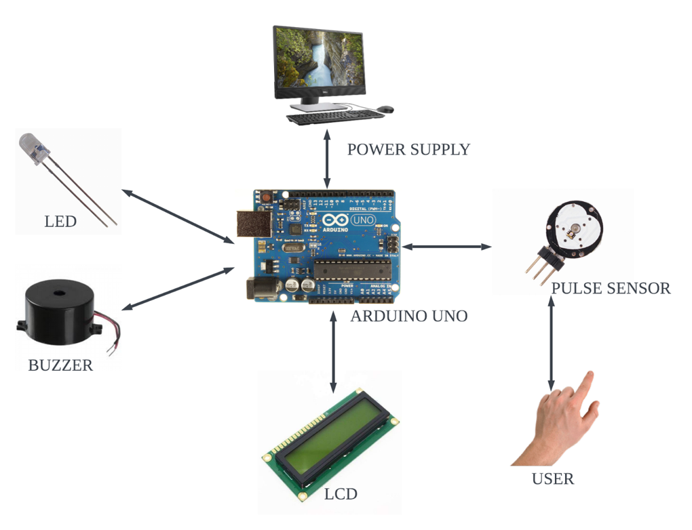

# 🩺 Heart-Rate-Monitoring-System
Developed an end-to-end IoT system to capture and process PPG (Photoplethysmogram) signals, implementing Digital Signal 
Processing (DSP) logic in C++ to filter noise and enhance signal quality from raw sensor data. 

Designed a real-time feedback loop for Heart Rate Variability (HRV) analysis, transforming raw optical biometric data into 
filtered, pulse rate metrics and pulse-synchronized auditory signals.

## Hardware Requirements
- Arduino Board
- Pulse Sensor
- LCD (Liquid-Crystal Display)
- LED (Liquid Emitting Diode)
- Buzzer
- Connecting Wires and Resistors
- Breadboard

## Software Requirements
- Arduino IDE (2.0.3)  Library installed - PulseSensor Playground by Joel Murphy, Yurvy Gitman, Brad Needham. Version 1.6.3

## Architectural Design

  

## System Design (Pin Diagram)

  

## Overall Design

  

## Results
**Overall System and PPS Graph**

  

